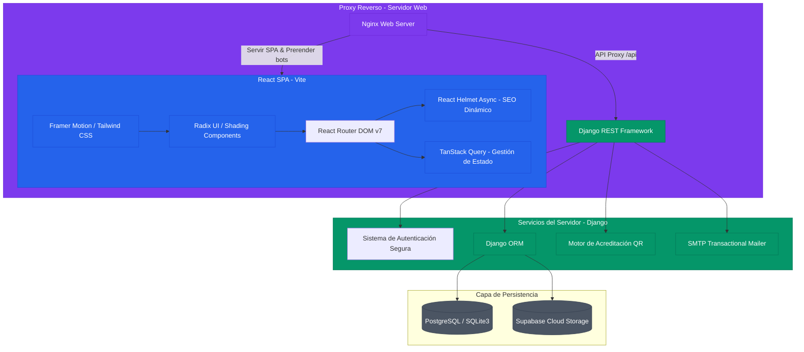

# 🌐 Congreso de Logística y Transporte UNAB 2026
> **Arquitectura, Ingeniería e Infraestructura Digital por [LDE-System](https://github.com/lucasechavarria)**

---

[](LICENSE)
[](https://vitejs.dev/)
[](https://react.dev/)
[](https://www.djangoproject.com/)
[](https://vitest.dev/)
[](https://pre-commit.com/)

Plataforma de nivel empresarial diseñada y desarrollada individualmente bajo la firma **LDE-System** para la gestión, difusión y acreditación en tiempo real del **Congreso de Logística y Transporte UNAB**. 

Este sistema proporciona una experiencia de usuario (UI/UX) premium con animaciones fluidas de nivel cinemático, junto con un robusto motor administrativo de Django REST Framework en el backend, integrando acreditaciones mediante códigos QR autogenerados y emisión automatizada de certificados digitales en formato vectorizado.

---

## 🏛️ Arquitectura del Sistema (Monorepo)

La plataforma está organizada en un patrón monorepo modularizado y desacoplado, diseñado para facilitar despliegues continuos (CI/CD) de forma independiente para el cliente estático (SPA) y los servicios de la API en la nube.



---

## ⚡ Estándares de Ingeniería y Calidad de Código

Este proyecto ha sido concebido bajo los principios del desarrollo de software moderno y los estándares rigurosos de un **Staff Engineer**:

*   **Calidad Sintáctica Automatizada:** Integración obligatoria de **pre-commit hooks** (`.pre-commit-config.yaml`) que ejecutan Prettier para formateo uniforme e inspecciones estáticas previas a cada commits, previniendo regresiones de estilo.
*   **Gestión de Rendimiento en Compilación:** Configuración optimizada de Vite utilizando `@vitejs/plugin-react-swc` (compilador de alta velocidad escrito en Rust) y generación selectiva de sourcemaps, garantizando cargas de compilación optimizadas de memoria y archivos estáticos minimizados en la distribución final (`dist/spa`).
*   **Abstracción de Lógica Asíncrona (TanStack Query):** Gestión avanzada de caché del cliente, reduciendo la latencia de red y evitando múltiples peticiones innecesarias de ponencias, cronograma e información del evento.
*   **Estrategia SEO de Vanguardia:** Inyección dinámica de esquemas de datos estructurados de Schema.org (`Event`, `Person`, `Organization`) mediante React Helmet Async, preparados para la indexación y prerenderizado del proxy en producción (Nginx + Prerender.io o SSR Híbrido con Django).

---

## 📦 Estructura del Repositorio

*   `client/`: Código fuente de la Single Page Application (React, TypeScript, CSS global, componentes reutilizables, hooks y páginas dinámicas).
*   `backend/`: Lógica de negocio (Modelos Django, serializadores DRF, vistas API de administración, generadores de credenciales QR y PDF, y sistema de plantillas).
*   `shared/`: Recursos estáticos de diseño e interfaces tipadas compartidas.
*   `docs/`: Manifiestos de diseño, guías de integración y notas históricas del proyecto.
*   `vite.config.ts`: Configuración fina del compilador Vite y proxy de desarrollo.
*   `.pre-commit-config.yaml`: Orquestación de ganchos Git para control de calidad.

---

## 🚀 Guía de Instalación y Ejecución Local

### 1. Requisitos Previos
*   Node.js (versión 18 o superior)
*   Python (versión 3.10 o superior)
*   Administrador de paquetes de preferencia (`pnpm`, `npm` o `yarn`)

### 2. Configuración del Backend (Django)
```bash
# Navegar al directorio del backend
cd backend

# Crear entorno virtual de Python
python -m venv venv

# Activar el entorno virtual
# En Windows:
.\venv\Scripts\Activate.ps1
# En macOS/Linux:
source venv/bin/activate

# Instalar dependencias requeridas
pip install -r requirements.txt

# Ejecutar migraciones e inicializar base de datos
python manage.py migrate

# Iniciar servidor de desarrollo en puerto 8000
python manage.py runserver
```

### 3. Configuración del Frontend (React + Vite)
```bash
# En la raíz del proyecto (donde se ubica package.json)
# Instalar dependencias del cliente de forma optimizada
pnpm install  # o bien: npm install

# Iniciar el servidor de desarrollo de Vite (puerto 8080 con auto-proxy hacia el backend)
pnpm run dev  # o bien: npm run dev
```

### 4. Ejecución de Pruebas Unitarias
El proyecto cuenta con un entorno de pruebas robusto montado sobre `vitest` para garantizar la estabilidad del software:
```bash
pnpm run test  # o bien: npm run test
```

---

## 🛠️ Despliegue de Producción (Recomendado)
El proyecto incluye orquestadores y archivos preparados para despliegues profesionales:
*   `docker-compose.prod.yml`: Contenedores configurados y listos para producción.
*   `backend/Dockerfile.prod`: Construcción óptima del contenedor de Django para servicios API de alta concurrencia.
*   `vercel.json` / `vite.config.ts`: Preparados para servir el estático del cliente de forma optimizada.

---

*Desarrollado de forma individual como plataforma de gestión integral y demostración arquitectónica premium por **[LDE-System](https://github.com/lucasechavarria)**.*
