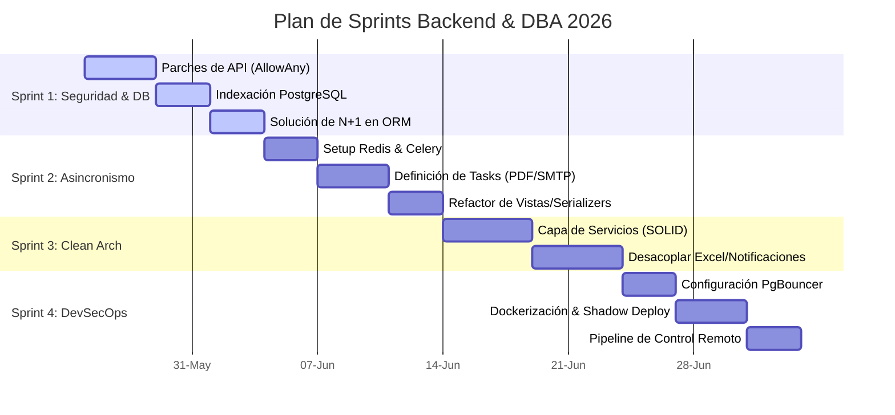

# 🗺️ Hoja de Ruta y Plan de Sprints: Backend & DBA
## Congreso de Logística y Transporte UNAB 2026

Este documento organiza de manera cronológica y por nivel de criticidad el plan de acción para las optimizaciones y refactorizaciones del backend (Django REST Framework) y la base de datos (PostgreSQL), coordinando un despliegue seguro libre de caídas (*Zero-Downtime*) bajo el contexto operativo de un servidor universitario administrado remotamente mediante GitHub Actions.

---

## 📅 Cronograma de Sprints Backend



---

## 🏃 SPRINT 1: Parches de Seguridad y Aceleración de Consultas
**Duración Sugerida:** 10 días  
**Criticidad:** 🔴 **Máxima** (Mitigación de riesgos en producción)  
**Objetivo:** Eliminar la exposición de endpoints sensibles, crear índices de base de datos para evitar Table Scans y optimizar Django ORM para consultas masivas.

### 📋 Tareas Técnicas

#### 1. Restricción de Acceso a Endpoints Sensibles
*   **Archivos:** [views.py](file:///c:/Users/User/Desktop/Congreso-UNAB-main/backend/api/views.py)
*   **Acción:** Reemplazar `permission_classes = [AllowAny]` por `[IsAuthenticated, IsAdminUser]` en:
    *   `CargaMasivaAsistentesCompletaView`
    *   `CargaMasivaAsistentesView`
    *   `EnvioMasivoEmailsView`
*   **Impacto:** Evita que bots o usuarios no autenticados puedan inyectar miles de registros a la base de datos o gatillar el envío de miles de correos de spam, lo cual congelaría el servidor SMTP de la universidad.

#### 2. Indexación B-Tree de PostgreSQL (DBA)
*   **Archivos:** [models.py](file:///c:/Users/User/Desktop/Congreso-UNAB-main/backend/api/models.py)
*   **Acción:** Agregar `db_index=True` en los modelos de Django para las columnas más utilizadas en filtros de búsqueda y ordenamiento del Django Admin y el CRM:
    *   `Asistente.first_name` y `Asistente.last_name` (Acreditaciones y búsqueda).
    *   `PostulacionDisertante.dni` (Lookup del CRM de disertantes).
    *   `PostulacionDisertante.fecha_postulacion` (Ordenamiento por defecto del modelo `ordering = ['-fecha_postulacion']` para evitar ordenamiento costoso en memoria).
    *   `Empresa.nombre_empresa` (Ordenamiento por defecto del listado de logos).
    *   `Empresa.email_contacto` (Lookup de CRM empresarial).
*   **Acción de ejecución:** Generar la migración de Django (`makemigrations`) y correrla localmente antes de programar su aplicación en caliente.

#### 3. Solución a Consultas N+1 (Django ORM)
*   **Archivos:** [views.py](file:///c:/Users/User/Desktop/Congreso-UNAB-main/backend/api/views.py)
*   **Acción:** Inyectar optimizaciones de QuerySets:
    *   En `ProgramaViewSet`: Modificar el queryset para usar `.prefetch_related('disertantes')`.
    *   En listados de asistentes administrativos: Reemplazar el bucle de consultas dinámicas en el serializer cargando previamente las inscripciones y detalles de perfiles mediante `.select_related('detalle_estudiante', 'detalle_docente', 'detalle_profesional', 'detalle_grupo').prefetch_related('inscripciones')`.

---

## 🏃 SPRINT 2: Integración de Celery y Redis (Cola de Tareas de Fondo)
**Duración Sugerida:** 10 días  
**Criticidad:** 🟠 **Alta** (Estabilidad del servidor en picos de inscripción)  
**Objetivo:** Delegar las tareas pesadas de red e infraestructura (SMTP, generación de Excel, rendering de PDFs) a procesos asíncronos en segundo plano para evitar caídas del servicio por timeouts.

### 📋 Tareas Técnicas

#### 1. Integración de Celery y Redis
*   **Archivos:** `backend/core/celery.py` (Nuevo), `backend/core/__init__.py` (Modificar).
*   **Acción:** Configurar Celery en Django utilizando una base de datos Redis que correrá de forma local en el puerto `6379`.
*   **Impacto:** Permite encolar trabajos pesados en milisegundos y liberar inmediatamente los workers de Django (Gunicorn/WSGI).

#### 2. Definición de Tareas Asíncronas (Tasks)
*   **Archivos:** `backend/api/tasks.py` (Nuevo)
*   **Acción:** Mudar la lógica síncrona a funciones asíncronas decoradas con `@shared_task(bind=True, max_retries=3)`:
    *   `task_enviar_confirmacion_individual(asistente_id)`: Para el registro síncrono.
    *   `task_enviar_confirmacion_grupal(representante_id)`: Mueve la generación pesada del Excel con Pandas y el envío secuencial de correos al worker de fondo.
    *   `task_generar_y_enviar_certificado(certificado_id)`: Mueve el rendering de imágenes grandes con Pillow (CPU bound) y la comunicación SMTP lenta de red.

#### 3. Encolamiento Seguro (Manejo de Transacciones)
*   **Archivos:** [serializers.py](file:///c:/Users/User/Desktop/Congreso-UNAB-main/backend/api/serializers.py), [views.py](file:///c:/Users/User/Desktop/Congreso-UNAB-main/backend/api/views.py)
*   **Acción:** Reemplazar el envío directo de correos en serializers y vistas por llamadas seguras a Celery:
    ```python
    from django.db import transaction
    from .tasks import task_enviar_confirmacion_individual
    
    transaction.on_commit(lambda: task_enviar_confirmacion_individual.delay(asistente.id))
    ```
*   **Impacto:** El callback `transaction.on_commit` asegura que Celery solo empiece a buscar el registro cuando PostgreSQL haya confirmado que los datos están físicamente guardados, eliminando errores por falta de sincronía (*Race Conditions*).

---

## 🏃 SPRINT 3: Arquitectura Limpia y Desacoplamiento (SOLID)
**Duración Sugerida:** 10 días  
**Criticidad:** 🟡 **Media** (Mantenibilidad a largo plazo)  
**Objetivo:** Separar las responsabilidades de los Serializers (DRF) e implementar la lógica de negocio nuclear en la capa de Servicios.

### 📋 Tareas Técnicas

#### 1. Centralizar la Lógica en Capa de Servicios
*   **Archivos:** `backend/api/services.py` (Modificar)
*   **Acción:** Crear la función orquestadora `register_asistente_and_enroll(validated_data, integrantes_data=None)`.
    *   Mudar toda la lógica transaccional de inscripción grupal y asignación de perfiles fuera de `AsistenteSerializer.create()`.
    *   El serializer pasa a ser un mero validador del JSON de entrada, que al final delega la lógica de negocio al servicio.
*   **Impacto:** Permite realizar pruebas unitarias sobre el flujo de inscripciones de forma independiente de las peticiones HTTP y DRF.

#### 2. Desacoplamiento de Utilidades de Infraestructura
*   **Acción:** Extraer la lógica de generación de planillas Excel de miembros de grupos a un módulo independiente de utilidades (`utils/excel_generator.py`).
*   **Impacto:** Los módulos encargados de enviar correos no vuelven a importar Pandas ni librerías de generación de archivos de forma directa, cumpliendo el principio de inversión de dependencias.

---

## 🏃 SPRINT 4: Entorno Multi-servicio Dockerizado y Transición Segura
**Duración Sugerida:** 10 días  
**Criticidad:** 🟠 **Alta** (Seguridad operativa en vivo)  
**Objetivo:** Dockerizar la aplicación e implementar connection pooling (PgBouncer) protegiendo el sistema en vivo contra caídas imprevistas mediante despliegue en sombra (*Shadow / Blue-Green Deployment*).

### 📋 Tareas Técnicas

#### 1. Configurar PgBouncer en Transaction Mode (DBA)
*   Configurar PgBouncer en el host o en contenedor dockerizado operando en modo **Transaction**. Mapear el pool hacia PostgreSQL nativo.
*   Modificar `settings.py` para usar el puerto del pooler (`6432`) y definir `DISABLE_SERVER_SIDE_CURSORS = True`.
*   **Impacto:** Permite manejar hasta 10 veces más peticiones concurrentes a la base de datos sin sobrepasar el límite de memoria del servidor físico universitario.

#### 2. Dockerización Completa de Servicios
*   Crear `Dockerfile` multi-stage ligero para la aplicación de Django.
*   Crear `docker-compose.prod.yml` que orqueste:
    *   `web` (Gunicorn sirviendo la API en puerto interno).
    *   `celery_worker` (Cola de procesamiento de tareas).
    *   `redis` (Broker de mensajería).

---

## 🐳 Análisis Detallado: Despliegue Dockerizado Seguro y Libre de Caídas (Zero-Downtime)

Dado que la plataforma **ya se encuentra en producción** y el administrador **no posee acceso directo SSH** al servidor (dependiendo del pipeline de comandos a través del GitHub Self-Hosted Runner), una actualización a ciegas directa sobre Docker tiene un **riesgo altísimo de colisión o caída del sistema**.

A continuación, se detalla el análisis de riesgos y la estrategia quirúrgica para transicionar a Docker a través del runner de GitHub con un **0% de riesgo de interrupción**.

### ⚠️ Matriz de Riesgos Identificados

1.  **Colisión de Puertos:** Si levantamos los contenedores de Docker e intentan bindear los puertos activos del host (ej. `8000` para Django o `5432` para PostgreSQL), el comando de Docker fallará, bloqueando el pipeline.
2.  **Pérdida de Datos en Caliente (PostgreSQL):** Si dockerizamos PostgreSQL e intentamos levantar la base dentro de un contenedor:
    *   Colisionará con el PostgreSQL físico nativo del servidor universitario.
    *   Corremos el riesgo de perder o no mapear adecuadamente la base de datos real con inscritos activos si se detiene la base física repentinamente.
3.  **Pérdida de Archivos Multimedia de Usuarios (Media Volúmenes):** Fotos de disertantes, logos de sponsors y PDFs de certificados generados se almacenan físicamente en el disco del host. Al cambiar al contenedor, si no hay un mapeo explícito absoluto del volumen, el sistema dejará de encontrar todos los archivos previos (arrojará 404).

---

### 🛡️ Estrategia Quirúrgica de Transición (Blue-Green / Shadow Deploy)

Para transicionar de forma 100% segura sin tocar el servidor directamente, implementamos la siguiente hoja de ruta en el pipeline de GitHub Actions:

```
  Tráfico de Producción (Puerto 80/443 Nginx) ──> Apunta a Django Nativo (Puerto 8000)
                                                                 │
  [Paso 1: Shadow Deploy] Levantar Docker Compose en Puerto Sombra (Ej. 8080) 
  [Paso 2: Conexión Híbrida] Contenedor Docker ──> Conecta a PostgreSQL Nativo en Host (Sin mover datos)
  [Paso 3: Mapeo de Volúmenes] Docker Volume ──> Lee /var/www/media/ directo del disco físico
  [Paso 4: Verificación Remota] Testear Puerto Sombra (http://localhost:8080/api/) desde el Runner
                                                                 │
  [Paso 5: Switch en Caliente] Nginx se reconfigura para apuntar a Puerto 8080 (0.001s Downtime)
```

#### Paso A: Conexión Híbrida a Base de Datos Nativa
La base de datos PostgreSQL **debe seguir corriendo nativamente sobre el sistema operativo del host**. No tocaremos el PostgreSQL físico para evitar cualquier riesgo de pérdida de datos.
*   En el archivo de variables `.env` de producción que inyecta GitHub Actions, configuraremos la conexión de Django apuntando a la IP local del host:
    ```bash
    DB_HOST=172.17.0.1   # IP interna por defecto de la interfaz docker0 en Linux
    DB_PORT=5432         # Apunta al puerto físico nativo de PostgreSQL del servidor
    ```

#### Paso B: Levantar Docker Compose en Puerto Sombra ("Shadow Port")
En el archivo `docker-compose.prod.yml`, configuramos la aplicación Django web para escuchar en el host a través del puerto `8080` en lugar de competir con el puerto actual de producción (`8000` o el que use Gunicorn nativo):

```yaml
version: '3.8'

services:
  redis:
    image: redis:7-alpine
    container_name: congreso_redis
    expose:
      - "6379"
    restart: always

  celery_worker:
    build:
      context: ./backend
      dockerfile: Dockerfile.prod
    container_name: congreso_celery
    command: celery -A core worker --loglevel=info --concurrency=2
    environment:
      - DB_HOST=172.17.0.1
      - REDIS_URL=redis://redis:6379/0
    volumes:
      - /var/www/congreso/media:/app/media   # <--- Mapeo crítico para persistencia de archivos reales
    depends_on:
      - redis
    restart: always

  web:
    build:
      context: ./backend
      dockerfile: Dockerfile.prod
    container_name: congreso_django_web
    command: gunicorn core.wsgi:application --bind 0.0.0.0:8000 --workers 3
    ports:
      - "8080:8000"  # <--- PUERTO SOMBRA: Evita colisiones de puerto con el Django nativo actual
    environment:
      - DB_HOST=172.17.0.1
      - REDIS_URL=redis://redis:6379/0
    volumes:
      - /var/www/congreso/media:/app/media   # <--- Lee los mismos archivos que usa la app activa
    depends_on:
      - redis
    restart: always
```

#### Paso C: Prueba de Humo y Verificación Remota (Desde GitHub Actions)
Una vez levantado Docker en el host mediante el pipeline (`docker compose -f docker-compose.prod.yml up -d`), realizamos una prueba de humo automatizada para validar que los contenedores están respondiendo correctamente y conectando a la DB nativa:

```bash
# Script de validación ejecutado por el Runner en el host físico:
echo "Verificando el estado del puerto sombra..."
sleep 5 # Dar tiempo a que Django inicialice
if curl -f http://localhost:8080/api/ediciones/ > /dev/null; then
    echo "¡Exito! El contenedor de Docker responde correctamente en el puerto sombra."
else
    echo "Fallo en la inicialización del contenedor. Manteniendo despliegue nativo activo."
    docker compose -f docker-compose.prod.yml down
    exit 1
fi
```

#### Paso D: Conmutación de Reverse Proxy (El Switch Final sin caída)
El servidor web Nginx nativo en la universidad es quien recibe las solicitudes públicas y las deriva a Django. Actualmente su bloque de configuración (`/etc/nginx/sites-available/congreso`) apunta al socket o puerto nativo del host (ej. `proxy_pass http://127.0.0.1:8000;`).

Para conmutar de la versión nativa vieja a la versión dockerizada nueva sin desconectar a nadie:
1.  Utilizamos un script en GitHub Actions que reemplace en el archivo de configuración de Nginx el puerto `8000` por el puerto sombra `8080`.
2.  Ejecutamos la recarga en caliente de Nginx desde el runner:
    ```bash
    sudo nginx -t && sudo systemctl reload nginx
    ```
    *(La recarga en caliente no cierra sockets de red abiertos. Las nuevas conexiones se enrutan de inmediato al puerto 8080, mientras las viejas finalizan en el 8000 de forma transparente).*
3.  **Apagado Seguro:** Tras validar en producción que la versión dockerizada opera perfectamente, procedemos a dar de baja y desactivar el antiguo servicio systemd nativo en el host.

---

## 🔒 Contingencia y Rollback Automático

Si tras la transición algo falla con los workers de Celery o se detectan anomalías de red, el pipeline permite ejecutar un rollback inmediato en menos de un segundo:
1.  Revertir la configuración de Nginx para apuntar nuevamente al puerto nativo original `8000`.
2.  Hacer reload en caliente: `sudo systemctl reload nginx`.
3.  Levantar el antiguo servicio systemd.
4.  De esta forma, el sistema vuelve a su estado nativo de producción original de inmediato, garantizando resiliencia y **cero minutos de indisponibilidad** (*Zero-Downtime*).
